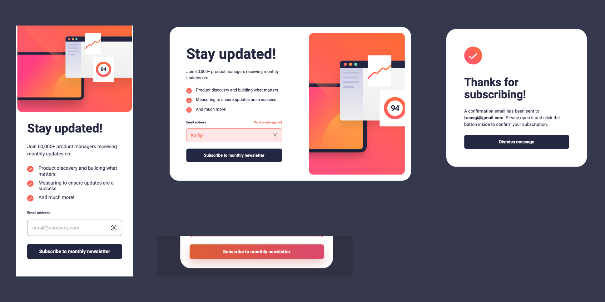

# Frontend Mentor - Newsletter sign-up form with success message solution

This is a solution to the [Newsletter sign-up form with success message challenge on Frontend Mentor](https://www.frontendmentor.io/challenges/newsletter-signup-form-with-success-message-3FC1AZbNrv). Frontend Mentor challenges help you improve your coding skills by building realistic projects. 

## Table of contents

- [Overview](#overview)
  - [The challenge](#the-challenge)
  - [Screenshot](#screenshot)
  - [Links](#links)
- [My process](#my-process)
  - [Built with](#built-with)
  - [What I learned](#what-i-learned)
  - [Continued development](#continued-development)
  - [Useful resources](#useful-resources)
  - [AI Collaboration](#ai-collaboration)

## Overview

### The challenge

Users should be able to:

- Add their email and submit the form
- See a success message with their email after successfully submitting the form
- See form validation messages if:
  - The field is left empty
  - The email address is not formatted correctly
- View the optimal layout for the interface depending on their device's screen size
- See hover and focus states for all interactive elements on the page

### Screenshot

### Links

- Solution URL: [Git](https://github.com/GimeVerdant/newsletter_signup)
- Live Site URL: [Page](https://gimeverdant.github.io/newsletter_signup/)

## My process

### Built with

- Semantic HTML5 markup
- CSS custom properties
- Flexbox
- CSS Grid
- Mobile-first workflow
- JS

### What I learned

JS form handling - getting elements, submitting, validating

css -used transform: scale(1.01) to hide black border of teh svg when on tablet view.

### Continued development

More JS

### AI Collaboration

I used Claude and Claude Code
I thought on what I needed to do to ask, submit, validate and confirm the email 
I asked Claude to give me steps I would need to take to validate the form - Giving me NO CODE 
I used the answer to look up JS documentation on how to code the steps.
I found different pages online with soultions
I taped together a solution 
I asked Claude Code to review the code I wrote and give me anotated feedback
I used Claude Code to do a final check on the accessibility of the code - I decided which issues should be ignored (AI doesnt always get it right) and which fixed 
e.g 
Ignore - AI thinks there are two h1s - but they never show at the same time 
Accept - Visible focus style to buttons, add aria-live to success card

